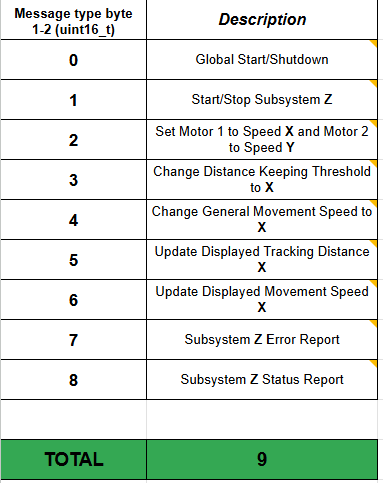

## 1) Team Block Diagram

Below is our connected team block diagram. It shows each individual block diagrams and then how all four will connect together physcially. The subsystems are chained togther with Divine's upstream of Andrey's, Andrey's upstream from Jacob's, Jacob's upstream from Jake's, and Jake's upstream from Divine's. Within each block diagram different colors are used for labeling different components to make it easier to visually see each system. Red is for power lines, purple is for any I2C or SPI components as well as the MQTT wifi, blue is for connections used to program the microcontroller, yellow is for UART Rx line to recieve messages and green is for the UART Tx line to transmit messages with orange showing the wires connecting each subsystem via UART and power. With our connectors our team can share power across all four boards while only one board is connected to an outside power source. The connectors have 8 pins we will be using 3 pins. Pin 1 as 9V power, pin 2 as UART either transmit or recieve, and Pin 8 as GND with every subsystem having uniform connector pins as set by the class standard. 

### Reference -> Individual Block Diagrams

Linked Below is each team member's individual block diagrams which go into more details about each block diagram.

- [Andrey's Block Diagram](https://lordandrey17.github.io/andreypodoprigora.github.io/Personal-Block-Diagram/)
- [Divine's Block Diagram](https://d-ndionye.github.io/blockdiagram/)
- [Jacob's Block Diagram](https://jaykee-5x5.github.io/Individual_Block_Diagram_and_Schematic/)
- [Jake's Block Diagram](https://jakestrube.github.io/DataSheet/Individual_BlockDiagram/)

## 2) Sequence Diagram of Team Communication

Below is our sequence diagram of team communication. It visualizes all the messages that we will send across our subsytems and how each message will interact with every subsystem and the user inputs. The messages at the top are sent as the inputs come in and the messages at the bottom in the loop are sent on a loop after a designated amount of time to keep updating certain variables. This loop allows the user to see the contiunues status of the device and the inputs allow the user to modify what the device is doing meeting the project requirements of displaying data and having an input that affects the whole system. 

## 3) Message Types

Below is a table of our message types that we will be sending which describes the different messages that we might send as a team and their identifier to allow for easier reading and debugging. We decided to give each message a simple one byte message type to put after the sender in our messages sent to allow the reciever to quickly figure out what message is being recieved and how to process it. Examples of the message type in use is shown in the Message Protocol further down.

## 4) Message protocol
The Message Protocol is all the messages that we will be actively sending and recieving for each subsystem and what each subsystem will do with each message and how each messgae is sent. Underneath the table is a key to help understand the table. We choose to only send these messages because it keeps the amount of messages down to avoid clogging the system as well as allows for easier debugging. We decided that we didn't need to send all of the message types because some of our orignial message types are not needed to be sent like error messages that each system can just show on their debugging LEDS or starting up and shutting down each subsystem.

| Message Type | Message ID *(Char)* | Andrey Role: Sensor ID: *A* | Jacob Role: Motor ID:*W* | Jake  Role: HMI ID: *S* | Divine Role: MQTT ID: *D*|
|--------------|------------|----------------------|--------------------|-----------------|-------------------|
| Update motor set speed | *2* | - | R: (Update speed at which motors move) | S: (HMI menu and button press) | S: (mqtt topic: /EGR314/TEAM204/MOTORSPEED) |
| Update distance threshold | *3* | R: (update distance sensor wants to keep) | - | S: (HMI menu and button press) | S: (mqtt topic: /EGR314/TEAM204/DISTANCE_SET) |
| Update displayed motor speed | *4* | - | - | S: (HMI menu and button press) R:(Displayed on HMI) | S: (mqtt topic: /EGR314/TEAM204/MOTORSPEED) R: (mqtt topic: /EGR314/TEAM204/MOTORSPEED)|
| Update displayed sensor distance | *5* | S: (Sensor Value) | - | R:(Displayed on HMI) | R: (mqtt topic: /EGR314/TEAM204/DISTANCE_VALUE) |

| KEY | Meaning |
| --- | ------- |
| S | Sender |
| R | Reciever |
| - | Pass message |

## 5) Biggest Changes to Software Design

Our Biggest changes that we made to the software design was our message protcol, how the motor and sensor subsystem communicated, how the HMI system let the user send messages, how the motors would change their speed, and how the wifi would affect the overall system.

The change to our message protcol was to make it simplier. We learned early on in our programming of the API that the more messages we have the harder it would be to make sure that each message worked and was properly received. We discovered that sending to many messages would jam the system and then the system recieving or the systems passing along messages would not be able to do any other processes because they could only process the messages. To fix this problem we reduced the amount of messages to the amount shown in the message protcol table as well as set delays between each message sent for example the sensor subsystem sneds its updated sensor value every fourth of a second rather than our orignal everytime the system updated because the system would update a new value so fast it would overload the HMI system not allowing the value to be displayed.

Another change we implemented was how the motor and the sensor subsystems communicated. Originally the systems would communicate through their own dedicated SPI channel so that the sensor could send a message to the motor without clogging up the UART lines for everyone else. We eventually changed this idea and just had the sensor and the motor communicate via UART and just connected the sensor subsystem upstream of the motor system so that their messages did not have the get passes along through anyone else. We also have a delay so that the messages do not flood the system as explained in the last paragraph. 

One software change that proved to be useful was the way that the HMI system would allow the user to send the messages to the other systems. A menu system was added onto the HMI system that allowed the user to use a dial to navigate a menu system and adjust the speed and distance that the motor and sensor subsytem would follow. This menu system allowed for better customized messages as the user could choose a value 0 through 100 for either the speed or sensor following distance which would then be processed to a hex number and sent thought a UART message to the respective system which would then decode the hex value back to a decimal number and then process the message accordingly. Using his hex system proved useful and made the API easier to read as the values could be anywhere from one digit to three digits but hex makes it always two digits allowing all systems to easily stitch the two bytes togther to form the hex value and decode it.

We also changed how the motors would adjust their speed according to the distance. Orignally we planned to set a max speed on the motors that would be set by the HMI or MQTT and then the speed would adjust exponentionally depending on the distance away from the object that the sensor detects. For example as the device approached an object the motors would get slower and slower allowing it to get to the correct distance more precisely. This proved to be difficult to intergrate and test on our system as the sensor would have to continuously update the motors and we would have to program an equation that would take the desired distance and the actual distance and make a control system so that the system would be critcally damped and not overshoot its desired distance. Instead we decided to go with just having a set speed that the HMI or MQTT would decide and then when the sensor detects that the device is within a desired range around the desired distance the motors would just turn off leading to a sudden stop and start when the device is not longer within the desired distance. This does lead to more strain on the motors and the structure of the device.

One last software change that we made was with the MQTT system. We origianlly were gonna have the MQTT be able to drive the device around almost like an RC device but as well as be able to change the distance and motor speed values but we decided to scrap that idea and just have the MQTT system update the distance and speed as the wifi proved to not have a fast enough response time and a hard to control UI.

We think that these software changes while taking away some features, made our device better and easier to work with for both the user and for us as the programmers.

