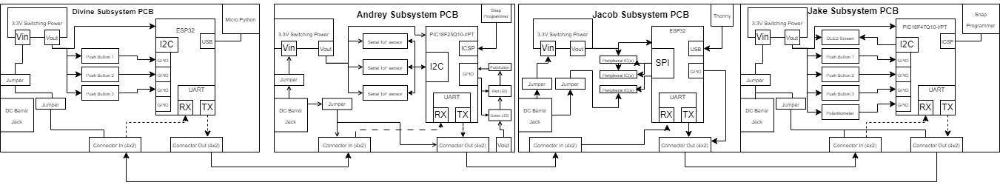
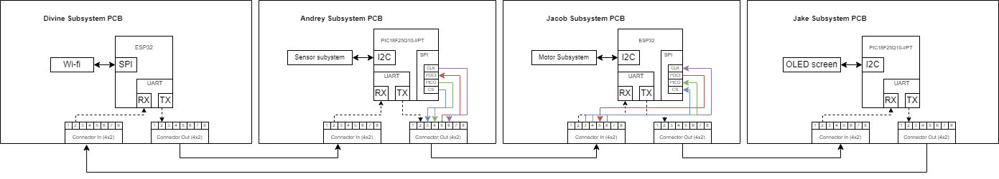
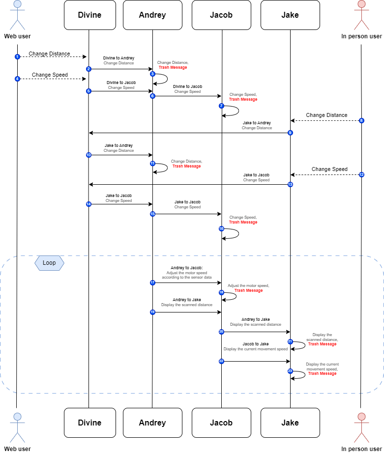
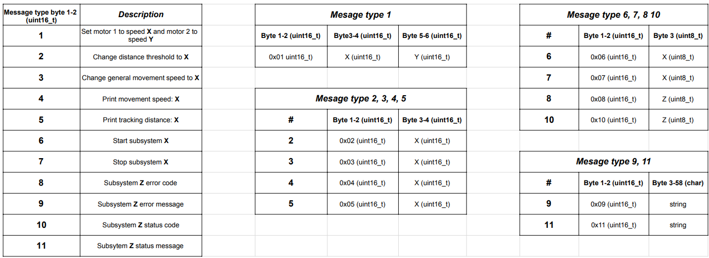

## 1) Team Block Diagram

Below is our connected team block diagram. It shows each individual block diagrams and then how all four will connect together physcially. The subsystems are chained togther with Divine's upstream of Andrey's, Andrey's upstream from Jacob's, Jacob's upstream from Jake's, and Jake's upstream from Divine's.

### Reference -> Individual Block Diagrams

Linked Below is each team member's individual block diagrams

- [Andrey's Block Diagram](https://lordandrey17.github.io/andreypodoprigora.github.io/Personal-Block-Diagram/)
- [Divine's Block Diagram]()
- [Jacob's Block Diagram]()
- [Jake's Block Diagram](https://jakestrube.github.io/DataSheet/Individual_BlockDiagram/)

### Ribbon Cable Connector Structure

## 2) Sequence Diagram of Team Communication

Below is our sequence diagram of team communication. It visualizes all the messages that we will send across our subsytems and how each message will interact with every subsystem and the user inputs. 

## 3) Message Types

Below is a combination of diagrams describing different types of messages that are being sent between individual boards

## Message protocol

| Message Type | Message ID *(Char)* | Andrey Role: Sensor ID: *A* | Jacob Role: Motor ID:*W* | Jake  Role: HMI ID: *S* | Divine Role: MQTT ID: *D*|
|--------------|------------|----------------------|--------------------|-----------------|-------------------|
| Update motor set speed | *2* | - | R: (Update speed at which motors move) | S: (HMI menu and button press) | S: (mqtt topic: /EGR314/TEAM204/MOTORSPEED) |
| Update distance threshold | *3* | R: (update distance sensor wants to keep) | - | S: (HMI menu and button press) | S: (mqtt topic: /EGR314/TEAM204/DISTANCE_SET) |
| Update displayed motor speed | *4* | - | - | S: (HMI menu and button press) R:(Displayed on HMI) | S: (mqtt topic: /EGR314/TEAM204/MOTORSPEED) R: (mqtt topic: /EGR314/TEAM204/MOTORSPEED)|
| Update displayed sensor distance | *5* | S: (Sensor Value) | - | R:(Displayed on HMI) | R: (mqtt topic: /EGR314/TEAM204/DISTANCE_VALUE) |

