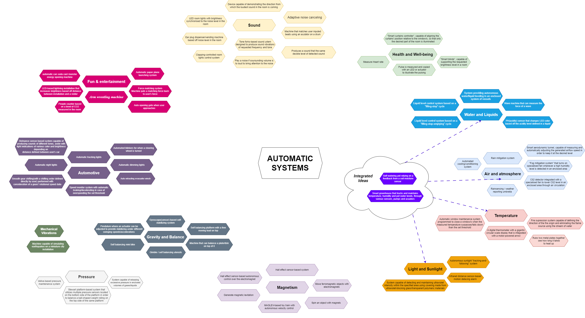
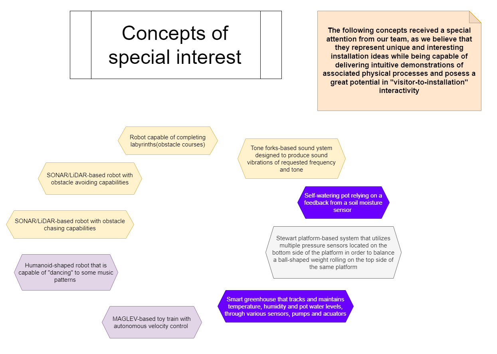

## Raw project concepts

The section below presents selection of the first ⁓100 concepts generated by the team in the initial stage of Design Ideation brainstorming. We came up with concepts that could teach all different kinds of scientific ideas and built off other ideas till we reached our desired amount.

## Sorting and Ranking the Project Concepts

In this section you can see the results of processing the array of concepts presented on a previous page. We organized the ideas in two sections with subsections in each section. The main sections are Robots and Automatic Systems. We leaned most towards these two categories because they would allow us to follow the project requirements with sensors actuators and userinput both through wifi and physical input. In the concepts of special intrest section we choose our favorite ideas that we had to help us further organize and narrow down our choices.

## Final Concept Selection

And here you can witness our team's final choice of the project's design concept. We went with the concept of a robot that can chase an object. We decided that this would be a great way to showcase how an IR sensor works and also allows us to demonstrate how technology like this is used in devices that people use on the daily and don't even realise it. The concept also includes different ways of how the user might interact with the project and how we could accommodate a variety of different people of different ages and backgrounds. We brainstormed these ideas of inclusion once we found our main concept to help us more carefully brainstorm on how to make our device accessible.

