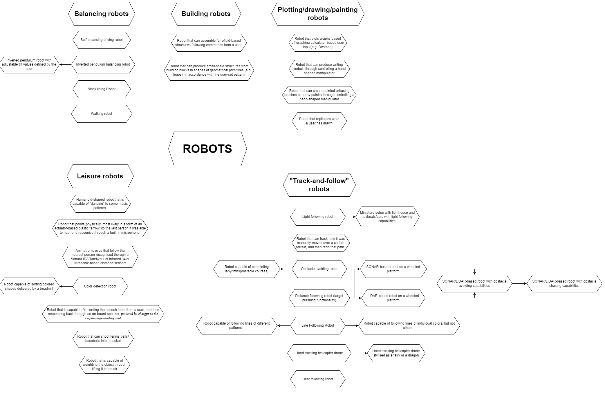
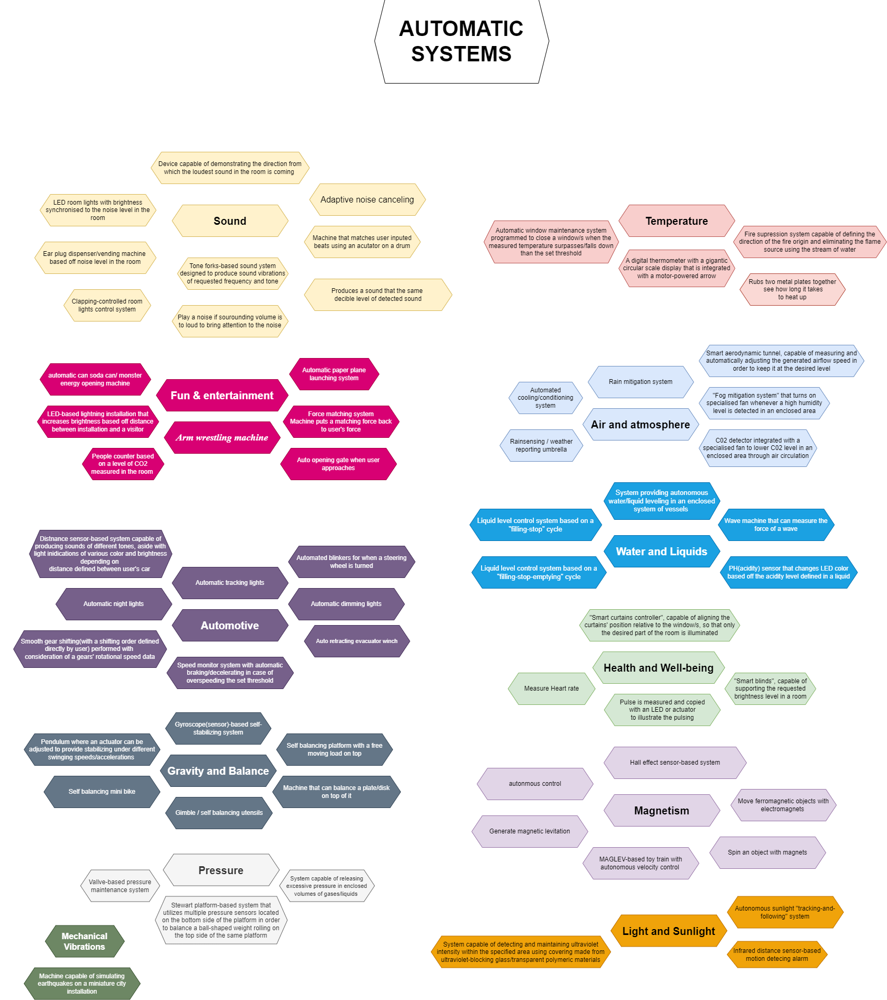
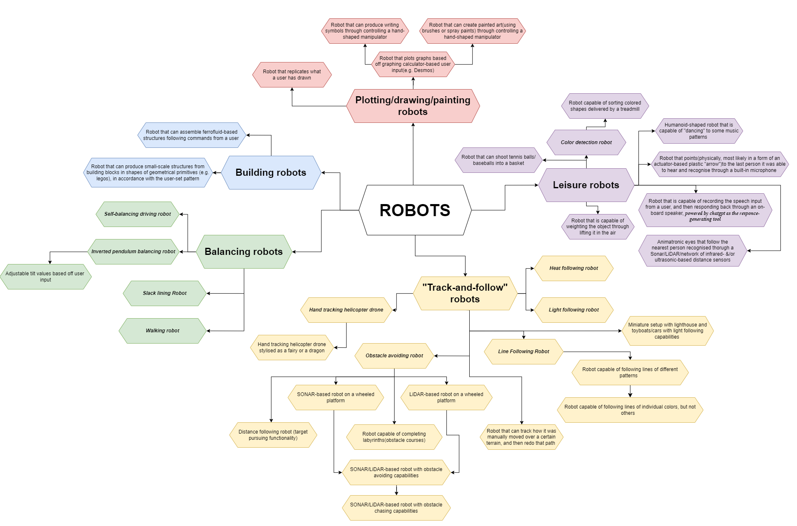

## Raw project concepts

The section below presents selection of the first ⁓100 concepts generated by the team in the initial stage of Desing Ideation brainstorming

## Sorting and Ranking the Project Concepts

In this section you can see the results of processing the array of concepts presented on a previous page

## Final Concept Selection

And here you can withness our team's final choice of the project's design concept!

