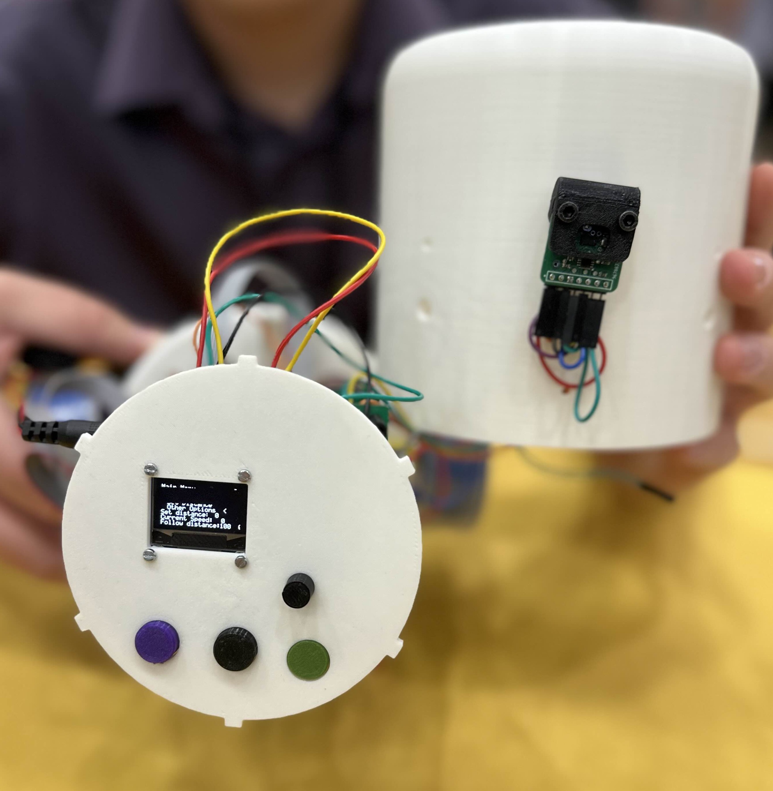

## CAD Files
Below are the CAD files that our team used to 3D model and 3D print our device and its various components for its structure. In each ZIP file is the STEP and STL Files
#### Robot Dome
- [Robot Dome zip Folder](Robot_Dome.zip)
#### Dome Top
- [Dome Top zip Folder](Dome_Top.zip)
#### PCB Supports
- [PCB Supports zip Folder](PCB_Supports.zip)
#### Custom Button
- [Custom Button zip Folder](Custom_Button.zip)
#### Custom Potentiometer Dial
- [Custom Potentiometer Dial zip Folder](Custom_Potentiometer_Dial.zip)
#### Sensor Cover
- [Sensor Cover zip file](Sensor_Cover.zip)

## Pictures and Videos
#### Final Project at Innovation Showcase

#### Team picture at Innovation Showcase

#### Video of System Demonstration
<iframe width="560" height="315" src="https://www.youtube.com/embed/6ImcAh9Klm4?si=FQz7dtPLLUcLQ3Gx" title="YouTube video player" frameborder="0" allow="accelerometer; autoplay; clipboard-write; encrypted-media; gyroscope; picture-in-picture; web-share" referrerpolicy="strict-origin-when-cross-origin" allowfullscreen></iframe>

