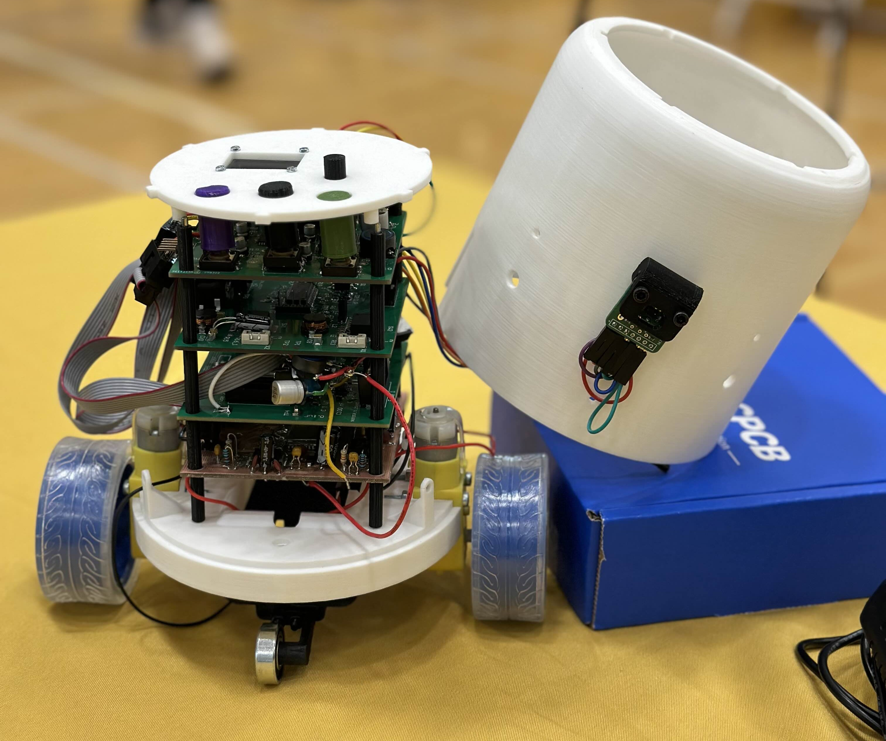

## EGR 314 Team 204 Embedded Systems Design

### Team 204
#### Team members and their individual websites
| Team member | Individual website | Subsystem |
|-------------|--------------------| --------- |
| Andrey Podoprigora | [Andrey's Website](https://lordandrey17.github.io/andreypodoprigora.github.io/) | Sensor Subsystem |
| Divine Ndionyenma | [Divine's Website](https://d-ndionye.github.io/) | MQTT Subsystem |
| Jacob Wilson | [Jacob's Website](https://jaykee-5x5.github.io/) | Actuator Subsystem |
| Jake Strube | [Jake's Website](https://jakestrube.github.io/) | HMI Subsystem |

#### Organizational info
Arizona State University 
Spring 2025 
EGR 314 
Professor Daniel Aukes 

### Project Overview
Our project is a robot that can keep a designated distance from an object in front of it. It works by using three IR distance sensors to track any object that is in front of it relaying information to Andrey's subsystem. Two of the sensors are angled 45 degrees to the side and one is facing straight ahead. When the sensor facing straight ahead detects and object it either drives towards or away from the object to keep its designated distance from the object. If one of the sensors on the side detects the object the robot will turn till the object is detected on the middle sensor. The robot moves via two motors that are mounted on its base structure and controlled via Jacob's actuator subsystem. The speed that the motors move and the distance at which the robot is to keep from its object can be controlled via MQTT through Divine's subsystem or through the HMI with Jake's subsystem. All of the subsystems communicate with each other via UART to work together to make one seemless system.

#### Final Product

#### Documentation
- [Team Orgnaization](Team_Organization)
- [Ideation and Concept Generation](Concept_Ideation)
- [Block Diagram and Communication](Block_Diagram_and_Communication)
- [Innovation Showcase Poster](Innovation_Showcase/index.md)
- [Reflection](Reflection/index.md)
- [Resources](Resources/index.md)
- [Appendix](appendix.md)

